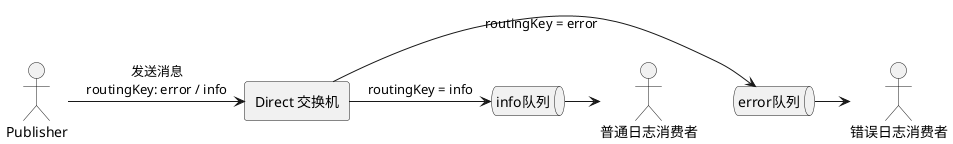

---

## 1. 什么是 Direct Exchange

**Direct Exchange（直连交换机）** 根据消息的 **Routing Key** 与队列的 **Binding Key** 进行**精确匹配**，只有两者完全相等时，消息才会被路由到对应队列。



与 Fanout 的核心区别：

||Fanout Exchange|Direct Exchange|
|---|---|---|
|路由方式|广播，忽略 Key|精确匹配 Routing Key|
|消息投递|所有绑定队列都收到|只有 Key 匹配的队列收到|
|适用场景|全局通知|按类型分类路由|

**两个特殊情况：**

- **一个队列绑定多个 Key**：该队列会接收任意一个 Key 匹配的消息
- **多个队列绑定相同 Key**：效果等同于 Fanout，多个队列同时收到消息

> [!tip] Tips 
> Direct Exchange 是实际项目中最常用的 Exchange 类型，按日志级别分发、按业务类型路由都是它的典型场景。

## 2. 使用 Spring AMQP 实现
### 2.1. 配置类声明式实现

#### 2.1.1. 完整配置类

```java
@Configuration
public class DirectConfig {

    public static final String EXCHANGE_DIRECT = "camellia.direct";
    public static final String QUEUE_DIRECT_A  = "camellia.direct.queueA";
    public static final String QUEUE_DIRECT_B  = "camellia.direct.queueB";

    // 声明 Direct 交换机（注意返回类型是 DirectExchange，不是 Exchange）
    @Bean
    public DirectExchange directExchange() {
        return new DirectExchange(EXCHANGE_DIRECT);
    }

    // 声明队列 A
    @Bean
    public Queue directQueueA() {
        return new Queue(QUEUE_DIRECT_A);
    }

    // 声明队列 B
    @Bean
    public Queue directQueueB() {
        return new Queue(QUEUE_DIRECT_B);
    }

    // 绑定队列 A，Binding Key = "error"
    @Bean
    public Binding bindDirectA(@Qualifier("directQueueA") Queue queue,
                                DirectExchange exchange) {
        return BindingBuilder.bind(queue).to(exchange).with("error");
    }

    // 绑定队列 B，Binding Key = "info"
    @Bean
    public Binding bindDirectB(@Qualifier("directQueueB") Queue queue,
                                DirectExchange exchange) {
        return BindingBuilder.bind(queue).to(exchange).with("info");
    }
}
```

> [!warning] 注意 
> 声明交换机时返回类型必须是 `DirectExchange`，不能写成父类 `Exchange`，否则 `BindingBuilder.bind().to()` 在编译期会找不到匹配的重载方法。

#### 2.1.2. 生产者

```java
@Autowired
private RabbitTemplate rabbitTemplate;

public void sendDirect(String routingKey, String message) {
    // 第二个参数是 Routing Key，Direct 模式下决定消息去哪个队列。
    rabbitTemplate.convertAndSend(DirectConfig.EXCHANGE_DIRECT, routingKey, message);
}

// 调用示例
sendDirect("error", "数据库连接失败");  // → 路由到 queueA
sendDirect("info",  "用户登录成功");    // → 路由到 queueB
sendDirect("debug", "调试信息");        // → 无匹配队列，消息丢弃
```

#### 2.1.3. 消费者

```java
@Slf4j
@Component
public class DirectListener {

    @RabbitListener(queues = DirectConfig.QUEUE_DIRECT_A)
    public void consumerA(String message) {
        log.error("[ERROR队列] Received: {}", message);
    }

    @RabbitListener(queues = DirectConfig.QUEUE_DIRECT_B)
    public void consumerB(String message) {
        log.info("[INFO队列] Received: {}", message);
    }
}
```

### 2.2. 注解声明式实现

无需单独编写配置类，直接在 `@RabbitListener` 中通过注解声明交换机、队列和绑定关系，Spring 容器启动时自动完成创建。

```java
@Slf4j
@Component
public class DirectAnnotationListener {

    @RabbitListener(bindings = @QueueBinding(
        value    = @Queue(name = "camellia.direct.queueA"),
        exchange = @Exchange(name = "camellia.direct2", type = ExchangeTypes.DIRECT),
        key      = {"error", "critical"}  // 该队列接收 error 和 critical 两种路由键
    ))
    public void consumerA(String message) {
        log.error("[ConsumerA] Received: {}", message);
    }

    @RabbitListener(bindings = @QueueBinding(
        value    = @Queue(name = "camellia.direct.queueB"),
        exchange = @Exchange(name = "camellia.direct2", type = ExchangeTypes.DIRECT),
        key      = {"info", "warn"}
    ))
    public void consumerB(String message) {
        log.info("[ConsumerB] Received: {}", message);
    }
}
```

**注解说明：**

| 注解              | 作用                                  |
| --------------- | ----------------------------------- |
| `@QueueBinding` | 整合声明队列、交换机和绑定关系                     |
| `@Queue`        | 声明队列，`name` 指定队列名                   |
| `@Exchange`     | 声明交换机，`type` 指定类型                   |
| `key`           | 绑定键（Binding Key），支持数组，即一个队列绑定多个 Key |

生产者无需任何改动，正常调用 `convertAndSend` 即可。

## 3. 两种实现方式对比

||配置类方式|注解方式|
|---|---|---|
|代码位置|集中在 `@Configuration` 类|分散在各消费者类|
|可读性|清晰，拓扑结构一目了然|简洁，但队列关系较分散|
|适合场景|队列较多、结构复杂|队列少、快速开发|
|推荐程度|✅ 生产环境推荐|✅ 原型/小项目推荐|